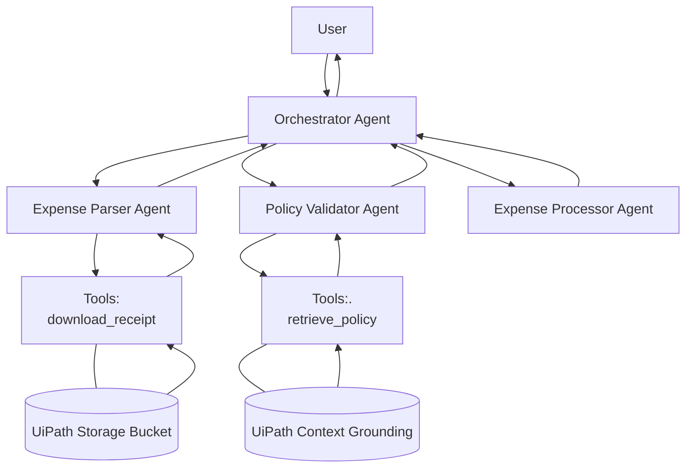

# Multi-Agent Expense Approval System

An intelligent expense approval system using OpenAI Agents SDK with UiPath integration. Learn the Orchestrator + Sub-agents pattern by creating a complete multi-agent workflow that automates expense validation against company policies.

---

## Agent Workflow (Agent Architecture)


---

## Prerequisites

* Python 3.11+ installed
* Access to UiPath Cloud and Orchestrator
* Git installed (optional, see below)

---

## Installation and Setup

1. **Download the repository:**

   You have two options:

   * **Option A: With Git**

     ```
     git clone https://github.com/rajneeshk94/ExpenseApprovalAgent.git
     ```
   * **Option B: Without Git (Download ZIP)**
     1. Click the green `<> Code` button.
     2. Select `Download ZIP`.
     3. Unzip the downloaded file (e.g., `ExpenseApprovalAgent-main.zip`) to your desired location.

2. **Navigate to the project directory:**

   ```
   # If you used git clone:
   cd ExpenseApprovalAgent

   # If you downloaded the ZIP, the folder name might be different:
   cd ExpenseApprovalAgent-main
   ```

3. **Create a virtual environment:**

   ```
   python -m venv .venv
   ```

4. **Activate the virtual environment:**

   * On Windows:

     ```
     .\.venv\Scripts\activate
     ```
   * On macOS/Linux:

     ```
     source .venv/bin/activate
     ```

5. **Update pip**

   ```
   python -m pip install --upgrade pip
   ```

6. **Install dependencies:**

   ```
   pip install -r requirements.txt
   ```

7. **Configure user details:**

   * Open the `pyproject.toml` file.
   * Change the `name` and `email` values to your name and email.

8. **Authenticate with UiPath:**

   ```
   uipath auth
   ```

9. **Package the project:**

   ```
   uipath pack
   ```

10. **Publish the project:**

    ```
    uipath publish
    ```

    * When prompted, type and select `0` for the default tenant.

---

## UiPath Cloud Setup

### Step 1: Prepare Your Storage Bucket

Before running the agent, prepare these in your UiPath setup:

1. Open [UiPath Cloud Platform](cloud.uipath.com)
2. Open the navigation panel
3. Click on `Orchestrator`
4. Click on `Shared` folder
5. Click on `Storage Bucket`


   * **Policy Document**
        - Click on Add storage bucket -> Create a new storage bucket
        - Type `expense-policy` under Name
        - Click Add
        - Click and open the created bucket
        - Click on `Upload Files`
        - Upload the policy file from this repo placed in `assets\ACME_TE_Policy_v4.2.pdf`
        - Click `Upload`

    * **Expense Receipt**
        - Click on Add storage bucket → Create a new storage bucket
        - Type `ExpenseReceipts` under Name
        - Click Add
        - Click and open the created bucket
        - Click on `Upload Files`
        - Upload the policy file from this repo placed in `assets\Expense_Claim.pdf`
        - Click `Upload`


### Step 2: Setup Context Grounding Index

1. Within the `Shared` folder click on `Indexes`
2. Click on `Create Index`
3. Type `expense-policy-index` under the `Index Name`
4. Select `Storage Bucket` under `Data Source`
5. Select `Shared` under `Orchestrator Folder`
6. Select `expense-policy` under `Storage Bucket`
7. Click `Save`

### Step 3: Serverless Runtime Assignment

**Note:** A **serverless runtime** must be assigned to the Shared folder for the agent to run.  
If not already configured, follow these steps:

1. Go to **Tenant** → **Folders**
2. Select **Shared folder** → **Machines tab**
3. If no serverless runtimes are added, click **Manage Machines in Folder**
4. Select **Default Cloud Robots - Serverless**
5. Click **Update**

---

## Usage

1. **Open UiPath Cloud** and navigate to **Orchestrator**.

2. Go to the **Shared folder**, then to **Processes**, and add the process named `ExpenseApprovalAgent`.

8. In the **Processes** section, start the `ExpenseApprovalAgent` job.

9. Provide the expense receipt filename as input like below:

````json
{
    "messages":"Expense_Claim.pdf"
}
````

10. Click **Start**.

11. **Open the Job Logs** to see traces and follow the execution of the agent.

---

## Expected Output

The agent returns a structured expense record:

```json
{
  "expense_id": "EXP-Expense_Claim.pdf",
  "amount": 250.50,
  "category": "Travel",
  "date": "2025-03-15",
  "within_policy": true,
  "policy_limit": 500.0,
  "flag_reason": null,
  "recommendation": "auto_approve"
}
```

---
## Local Testing

- Use or create a file similar to `input.json`
- Write a message telling the expense report name like below
````json
{
    "messages": "Check the expense claim for the file Expense_Claim.pdf"
}
````
- In the terminal run this command
````
uipath run agent -f input.json
````
- Follow the execution trail and see the final output

---

## Key Features

**Multi-Agent Architecture**
- **OrchestratorAgent**: Coordinates the workflow and maintains control
- **ExpenseParserAgent**: Downloads and parses PDF receipts from Storage Bucket
- **PolicyValidatorAgent**: Validates expenses using Context Grounding for policy lookup
- **ExpenseProcessorAgent**: Assembles final structured records with recommendations

**Intelligent Processing**
- Automatic document parsing with field extraction
- Policy compliance validation with semantic search
- Human-readable flag reasons for non-compliant expenses
- Auto-approval for policy-compliant submissions

---

## Troubleshooting

| Issue | Solution |
|-------|----------|
| **Import errors** | Ensure all dependencies in `requirements.txt` are installed |
| **File not found in bucket** | Verify filename matches exactly; check Storage Bucket path and permissions |
| **Policy context not found** | Ensure Context Grounding index is created and policy doc is properly indexed |
| **Authentication failed** | Run `uipath auth` again; verify UiPath credentials |
| **Serverless runtime error** | Check that Default Cloud Robots - Serverless is assigned to Shared folder |
| **Empty agent response** | Ensure expense receipt PDF has all required fields (date, amount, category) |

---

## Resources

- **UiPath OpenAI Agents Documentation:** [Quick Start Guide](https://uipath.github.io/uipath-python/openai-agents/quick_start/)
- **UiPath Python SDK:** Official documentation and examples
- **UiPath Context Grounding:** Semantic search and knowledge base setup
- **UiPath Storage Bucket:** File management and retrieval

---

## About

OpenAI Agents SDK to validate and process employee expense requests, with integration to UiPath Storage Bucket for document retrieval and UiPath Context Grounding for policy validation supported by UiPath SDK

---


**Need help?** Refer to the [UiPath OpenAI Agents Quick Start](https://uipath.github.io/uipath-python/openai-agents/quick_start/) or contact the project maintainer.